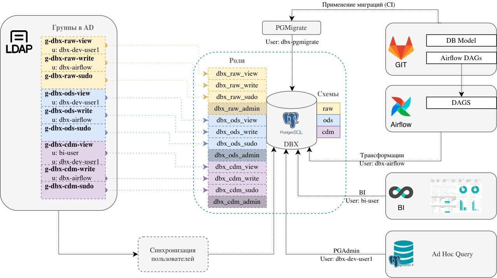

Не всегда команды, начинающие использовать PostgreSQL, сразу задумываются о ролевой модели и о версионировании схемы базы данных. Мы хотели облегчить задачу таким командам и предложили один из вариантов ролевой модели вместе с подходом gitops по управлению схемой данных.

## Ролевая модель.

Я работаю с PostgreSQL более 10 лет и периодически наблюдаю, как команды не задумываются на начальном этапе о ролевой модели базы, или все работает под суперпользователем postgres, забывают про версионирование схемы.

Когда я пришел в НЛМК, то захотел учесть свой опыт и предложить командам «пред настроенный PostgreSQL»

Мы хотели, чтобы составители миграций - наши пользователи не выдавали права на объекты в миграциях, а использовали простой и понятный подход вне их зоны контроля.

Подумав, мы собрали требования к ролевой модели:
- единицей владения выступает схема
- у каждой схемы свой владелец - роль (пользователь), под которой создаются и меняются объекты в схеме
- отдельная роль (группа) на чтение ко всем желементам внутри схемы
- отдельная роль (группа) с правами на запись в объекты схемы (таблицы, sequence), но не имеющая права изменять объекты в схеме

Итого, задача разработчкиа - постараться правильно сгруппировать таблицы по схемам, зная про доступные роли.

Шаблон наших ролей имеет вид:

`${prefix}${db_name}_${schema_name}_${role_name}`

* `prefix` - префикс для системных ролей (опционально)
* `db_name` -  имя базы данных
* `schema_name` - имя схемы, для которой создана роль
* `role_name` - имя роли


Рассмотрим необходимые нам роли(role_name):
* `owner` - владелец схемы. Роль типа `NOLOGON`. Эта роль непосредственно никому не присваивается, а передается через `sudo` роль (Ниже будет пример)
* `sudo` - роль типа `NOLOGON` и `NOINHERIT` (роль не наследует права ролей, членом которых она является), ей присвоена роль `owner`. Переключение на роль owner выполняется через `SET ROLE`.
* `view` - роль типа `NOLOGON`, через которую предоставляется доступ только на чтение к сущностям в схеме
* `write` - роль типа `NOLOGON`, через которую предоставляется доступ только на запись к сущностям в схеме
* `pgm` - роль типа NOLOGON для инструмента миграции схем

Сам скрипт создания ролей лежит на [github](https://github.com/e11it/pg_rbac_plus/).
В нем мы указываем название базы данных, список требуемых схем.
Если необходимо добавить новую схему, то надо еще раз прогнать скрипт, он идемпотентен.

Возможно, вам придется расширить права для ролей или как-то адаптировать их под себя.

#### Зачем нужна отдельная sudo роль и owner?

В PostgreSQL есть функционал, который позволяет задать права по умолчанию для создаваемых объектов - `DEFAULT PRIVILEGES`, но объекты должны быть созданы именно этой ролью.
Мы задаем `DEFAULT PRIVILEGES` для роли `owner`. Перед тем как что то создать, необходимо явно сделать `set role *_owner`.

Если мы просто добавим пользователя в эту роль, то он он сможет создавать объекты во всех схемах и может забыть сделать `set role`.

Чтобы решить эту проблему, мы сделали отдельную роль `_sudo` со свойством `NOINHERIT` , которая является членом роли `owner` и пользователь вынужден всегда делать `set role` явно.

Тем самым, пользователю не надо заботится о явном назначении прав на объекты в скриптах миграции, ему разрешается только создавать объекты и запрещается назначать какие либо права.

Стоит заметить, что утилита миграции `pgmigrate` создает в схеме свои технические таблицы и мы дали права на создание объектов и роли `sudo`. Но эти объекты создаются под техническим пользователем, под которым работает `pgmigrate`, и эти объекты не получают права ролей `view` и `write`.


## Миграция схем

После создания схем и базовых ролей, следующим важным компонентом является инструмент миграции.
Наш выбор пал на [PGMigrate](https://github.com/yandex/pgmigrate) от Yandex.
Он прост, позволяет использовать нашу ролевую модель, позоляет использовать подход `gitops`.

В git для проекта мы создаем следующую струкуру:

```
<db_name>/
    <schema_name>/
      migrations.yml
      <migrations>
      <callbacks>/
        <afterEach>/
          00_after_each.sql
        <beforeEach>/
          00_before_each.sql
  ...
```

Для генерации структуры можно воспользоваться скриптом из того же репозитория в [github]().


В файле `migrations.yml` мы указываем запросы, которые будут выполнены до и после каждой версии миграции. 

```
callbacks:
  beforeEach:
    - callbacks/beforeEach
  afterEach:
    - callbacks/afterEach
conn: dbname=${db_name}
schema: ${schema_name}

```

`00_before_each.sql`, делаем `SET ROLE` на владельца схемы и устанавливаем `search_path` в имя схемы.

```
SET ROLE ${prefix}${db_name}_${schema_name}_owner;
SET search_path = '${schema_name}';

```

В `00_after_each.sql`, сбрасываем роль и `search_path`.
```
RESET ROLE;
SET search_path TO DEFAULT ;
```

Пример такой структуры можно посмотерть в директории `migrations` на [github](https://github.com/e11it/pg_rbac_plus).

    
<details>
  <summary>Пример запуска кода с github</summary>

    
  ```sh
# Запускаем postgres и pgadmin
$ docker-compose up -d postgres pgadmin
# Создаем новую базу данных с именем dwh
$ docker-compose exec -u postgres postgres psql -c 'CREATE DATABASE dwh'
CREATE DATABASE
# Создаем схемы и ролевую модель
$ docker-compose exec -u postgres postgres /bin/bash /opt/scripts/create_schema.sh
Schema: dwh_raw
GRANT dwh_raw_view,dwh_raw_write TO dwh_raw_owner
GRANT dwh_raw_view TO dwh_raw_sudo
GRANT dwh_raw_owner TO dwh_raw_sudo
GRANT CONNECT ON DATABASE dwh TO dwh_raw_view
GRANT dwh_raw_view TO dwh_raw_write
GRANT usage ON SCHEMA raw TO dwh_raw_view
GRANT ALL ON SCHEMA raw TO dwh_raw_owner
GRANT ALL ON SCHEMA raw TO dwh_raw_pgm
GRANT dwh_raw_sudo TO dwh_raw_pgm
ALTER DEFAULT PRIVILEGES FOR ROLE dwh_raw_owner IN SCHEMA raw GRANT SELECT ON SEQUENCES TO dwh_raw_view
ALTER DEFAULT PRIVILEGES FOR ROLE dwh_raw_owner IN SCHEMA raw GRANT SELECT ON TABLES TO dwh_raw_view
ALTER DEFAULT PRIVILEGES FOR ROLE dwh_raw_owner IN SCHEMA raw GRANT ALL ON SEQUENCES TO dwh_raw_write
ALTER DEFAULT PRIVILEGES FOR ROLE dwh_raw_owner IN SCHEMA raw GRANT EXECUTE ON FUNCTIONS TO dwh_raw_write
ALTER DEFAULT PRIVILEGES FOR ROLE dwh_raw_owner IN SCHEMA raw GRANT INSERT,UPDATE,DELETE,TRUNCATE ON TABLES TO dwh_raw_write
Schema: dwh_ods
GRANT dwh_ods_view,dwh_ods_write TO dwh_ods_owner
GRANT dwh_ods_view TO dwh_ods_sudo
GRANT dwh_ods_owner TO dwh_ods_sudo
GRANT CONNECT ON DATABASE dwh TO dwh_ods_view
GRANT dwh_ods_view TO dwh_ods_write
GRANT usage ON SCHEMA ods TO dwh_ods_view
GRANT ALL ON SCHEMA ods TO dwh_ods_owner
GRANT ALL ON SCHEMA ods TO dwh_ods_pgm
GRANT dwh_ods_sudo TO dwh_ods_pgm
ALTER DEFAULT PRIVILEGES FOR ROLE dwh_ods_owner IN SCHEMA ods GRANT SELECT ON SEQUENCES TO dwh_ods_view
ALTER DEFAULT PRIVILEGES FOR ROLE dwh_ods_owner IN SCHEMA ods GRANT SELECT ON TABLES TO dwh_ods_view
ALTER DEFAULT PRIVILEGES FOR ROLE dwh_ods_owner IN SCHEMA ods GRANT ALL ON SEQUENCES TO dwh_ods_write
ALTER DEFAULT PRIVILEGES FOR ROLE dwh_ods_owner IN SCHEMA ods GRANT EXECUTE ON FUNCTIONS TO dwh_ods_write
ALTER DEFAULT PRIVILEGES FOR ROLE dwh_ods_owner IN SCHEMA ods GRANT INSERT,UPDATE,DELETE,TRUNCATE ON TABLES TO dwh_ods_write
Schema: dwh_cdm
GRANT dwh_cdm_view,dwh_cdm_write TO dwh_cdm_owner
GRANT dwh_cdm_view TO dwh_cdm_sudo
GRANT dwh_cdm_owner TO dwh_cdm_sudo
GRANT CONNECT ON DATABASE dwh TO dwh_cdm_view
GRANT dwh_cdm_view TO dwh_cdm_write
GRANT usage ON SCHEMA cdm TO dwh_cdm_view
GRANT ALL ON SCHEMA cdm TO dwh_cdm_owner
GRANT ALL ON SCHEMA cdm TO dwh_cdm_pgm
GRANT dwh_cdm_sudo TO dwh_cdm_pgm
ALTER DEFAULT PRIVILEGES FOR ROLE dwh_cdm_owner IN SCHEMA cdm GRANT SELECT ON SEQUENCES TO dwh_cdm_view
ALTER DEFAULT PRIVILEGES FOR ROLE dwh_cdm_owner IN SCHEMA cdm GRANT SELECT ON TABLES TO dwh_cdm_view
ALTER DEFAULT PRIVILEGES FOR ROLE dwh_cdm_owner IN SCHEMA cdm GRANT ALL ON SEQUENCES TO dwh_cdm_write
ALTER DEFAULT PRIVILEGES FOR ROLE dwh_cdm_owner IN SCHEMA cdm GRANT EXECUTE ON FUNCTIONS TO dwh_cdm_write
ALTER DEFAULT PRIVILEGES FOR ROLE dwh_cdm_owner IN SCHEMA cdm GRANT INSERT,UPDATE,DELETE,TRUNCATE ON TABLES TO dwh_cdm_write

# Создаем пользователя для выполнения миграций и добавляем в _pgm группы схем
$ docker-compose exec -u postgres postgres psql -c "create user pgmigrate with password '1234' in group dwh_raw_pgm,dwh_ods_pgm,dwh_cdm_pgm;"
CREATE ROLE

# Выполняем миграции
$ docker-compose run pgmigrate bash /opt/scripts/do_migrate.sh
+ pgmigrate -d /opt/migrations/dwh/raw -v -m raw --check_serial_versions -t latest migrate
+ pgmigrate -d /opt/migrations/dwh/ods -v -m ods --check_serial_versions -t latest migrate
+ pgmigrate -d /opt/migrations/dwh/cdm -v -m cdm --check_serial_versions -t latest migrate

# Подключаемся к базе dwh с помощью psql
$ docker-compose exec -u postgres postgres psql -d dwh
psql (15.1 (Debian 15.1-1.pgdg110+1))
Type "help" for help.
# Наши созданные скриптом create_schema.sh схемы
dwh=# \dn
List of schemas
Name  |       Owner
--------+-------------------
cdm    | postgres
ods    | postgres
public | pg_database_owner
raw    | postgres
(4 rows)

# Таблица foo создана pgmigrate c владельцем dwh_raw_owner
# Таблица schema_version - техническая для pgmigrate, без Access privileges
dwh=# \dt raw.*
List of relations
Schema |      Name      | Type  |     Owner
--------+----------------+-------+---------------
raw    | foo            | table | dwh_raw_owner
raw    | schema_version | table | pgmigrate

dwh=# \dp raw.*
Access privileges
Schema |      Name      | Type  |          Access privileges          | Column privileges | Policies
--------+----------------+-------+-------------------------------------+-------------------+----------
raw    | foo            | table | dwh_raw_view=r/dwh_raw_owner       +|                   |
|                |       | dwh_raw_write=awdD/dwh_raw_owner   +|                   |
|                |       | dwh_raw_owner=arwdDxt/dwh_raw_owner |                   |
raw    | schema_version | table |                                     |
(2 rows)
  ```
</details>

### Проверки в CI:

Перед миграцией в master мы выполняем следующие проверки:

- не изменены файлы уже примененных версий миграций
- в скритах нет set role или reset role
- имя файла в миграции соответствует требованиям PGMigrate: `V<version>__<description>.sql`
- версии в миграциях последовательно возрастают (PGMigrate умеет это проверять)
- изменяется только одна схема в директории со схемой (pgmigrate умеет это проверять, но непосредственно в момент применения миграций)
- наличие в скрипте миграции первой строкой указания использовать utf-8(`/* pgmigrate-encoding: utf-8 */`), чтобы избежать проблем с non-ascii символами.
- применение всех миграций в CI на временной БД для проверки на наличие ошибок в SQL коде 

После чего для каждой схемы, где были изменения, выполняем миграции с помощью команды: 

```sh
pgmigrate.py -d <db_name>/<schema_name> -v -m <schema_name> --check_serial_versions -t latest migrate
```

## Пользователи и группы

Мы стараемся везде использовать LDAP аутентификацию и не создавать локальных учетных записей.

На каждую роль `*_view`, `*_write` и `*_sudo` создается своя группа в AD.
Периодически скриптом мы синхронизируем членов этой группы с соответствующими группами в PostgreSQL, создаем отсутствующих пользователей. Наш скрипт умеет работать со вложенными группами, и это позволяет в качестве членов групп использовать другие группы в AD, например группа "все разработчики BI".

Полезно также иметь общую группу в AD на каждый сервер, включающую все эти группы, чтобы в `pg_hba.conf` или в PGAdmin дополнительно ограничить доступ с помощью `ldapsearchfilter`:

Пример из `pg_hba.conf`

```
# Все пользователи группы g-dbx-users, в том числе и во вложенных группах
host  all  all	0.0.0.0/0 ldap ldapserver=ldap.expample ldapsearchfilter="(&(samAccountName=$username)(memberof:1.2.840.113556.1.4.1941:=CN=g-dbx-users,OU=pg,....))"
```

## Реальный пример

Рассмотрим пример проекта, который использует описанный выше подход.

Его архитектура представлена ниже:



В базе данных созданы три схемы (слоя): raw, ods, cdm. На каждую схему в PostgreSQL созданы 4 роли(+1 для миграций - pgm). 

В LDAP на каждую схему создано три группы, соответствующие `*_view`, `*_write` и `*_sudo`.

Код миграций лежит в GIT. Миграции выполняются под доменным пользователем dbx‑pgmigrate, который входит в локальные группы `dbx_raw_pgm`, `dbx_ods_pgm`, `dbx_cdm_pgm` в PostgreSQL.

Перекладка данных между схемами/слоями осуществляется сервисом Airflow, который подключается к БД под пользователем dbx-airflow и имеет только write права на схемы.

Также на схеме присутствует BI сервис, который подключается к PostgreSQL под пользователем bi-user и имеет права только на чтение в схему CDM. И сервис PGAdmin, через который пользователь dbx-dev-user1 может подключаться к PostgreSQL и выполнять запросы на чтение во всех трех схемах.

## Итого

В современном мире стек используемых технологий только множится, мы вынуждены постоянно изучать новое. Человеческий ресурс так же ограничен, как и сроки проектов. Чтобы качество создаваемых сервисов росло, необходимо искать проблемные повторяющиеся места и скрывать их за более простой абстракцией.

Надеюсь, предложенный подход вам будет полезен!
